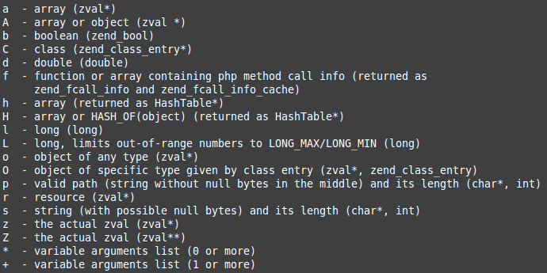

参数相关
=======

1、`int zend_parse_parameters(int num_args TSRMLS_DC, char *type_spec, ...)`

描述：函数负责读取用户从参数堆栈传递过来的参数，并将其适当地转换后放入局部C语言变量。

参数：传递给扩展函数的参数个数，参数类型说明符和一系列用来存储结果的变量指针。

返回值：SUCCESS或者FAILURE

类型说明符和变量存储结构：

* `|`：在该符号之后的参数都是可选的
* `/`：在该字符之前的变量如果不是通过引用传递，那么对其进行ZVAL分离，即执行`SEPARATE_ZVAL_IF_NOT_REF()`
* `!`：在该字符之前的变量可以为特定的类型或者NULL（对于上图中的说明符，除了'b'，'l'，'d'都适用），如果传递了NULL，那么指针将会指向NULL

> PHP源代码`phpsrc/README.PARAMETER_PARSING_API`文件有详细说明

示例代码（出自`phpsrc/README.PARAMETER_PARSING_API`）：
```c
/*rokety 2014-02-23*/
/* Gets a long, a string and its length, and a zval */
long l;
char *s;
int s_len;
zval *param;
if (zend_parse_parameters(ZEND_NUM_ARGS() TSRMLS_CC, "lsz",
                          &l, &s, &s_len, &param) == FAILURE) {
    return;
}


/* Gets an object of class specified by my_ce, and an optional double. */
zval *obj;
double d = 0.5;
zend_class_entry *my_ce;
if (zend_parse_parameters(ZEND_NUM_ARGS() TSRMLS_CC, "O|d",
                          &obj, my_ce, &d) == FAILURE) {
    return;
}


/* Gets an object or null, and an array.
   If null is passed for object, obj will be set to NULL. */
zval *obj;
zval *arr;
if (zend_parse_parameters(ZEND_NUM_ARGS() TSRMLS_CC, "o!a",
                          &obj, &arr) == FAILURE) {
    return;
}


/* Gets a separated array which can also be null. */
zval *arr;
if (zend_parse_parameters(ZEND_NUM_ARGS() TSRMLS_CC, "a/!",
                          &arr) == FAILURE) {
    return;
}

/* Get either a set of 3 longs or a string. */
long l1, l2, l3;
char *s;
/* 
 * The function expects a pointer to a integer in this case, not a long
 * or any other type.  If you specify a type which is larger
 * than a 'int', the upper bits might not be initialized
 * properly, leading to random crashes on platforms like
 * Tru64 or Linux/Alpha.
 */
int length;

if (zend_parse_parameters_ex(ZEND_PARSE_PARAMS_QUIET, ZEND_NUM_ARGS() TSRMLS_CC,
                             "lll", &l1, &l2, &l3) == SUCCESS) {
    /* manipulate longs */
} else if (zend_parse_parameters_ex(ZEND_PARSE_PARAMS_QUIET, ZEND_NUM_ARGS() TSRMLS_CC,
                                    "s", &s, &length) == SUCCESS) {
    /* manipulate string */
} else {
    /* output error */

    return;
}


/* Function that accepts only varargs (0 or more) */

int i, num_varargs;
zval ***varargs = NULL;


if (zend_parse_parameters(ZEND_NUM_ARGS() TSRMLS_CC, "*", &varargs, &num_varargs) == FAILURE) {
    return;
}

for (i = 0; i < num_varargs; i++) {
    /* do something with varargs[i] */
}

if (varargs) {
    efree(varargs);
}


/* Function that accepts a string, followed by varargs (1 or more) */

char *str;
int str_len;
int i, num_varargs;
zval ***varargs = NULL;

if (zend_parse_parameters(ZEND_NUM_ARGS() TSRMLS_CC, "s+", &str, &str_len, &varargs, &num_varargs) == FAILURE) {
    return;
}

for (i = 0; i < num_varargs; i++) {
    /* do something with varargs[i] */
}

if (varargs) {
    efree(varargs);
}


/* Function that takes an array, followed by varargs, and ending with a long */
long num;
zval *array;
int i, num_varargs;
zval ***varargs = NULL;

if (zend_parse_parameters(ZEND_NUM_ARGS() TSRMLS_CC, "a*l", &array, &varargs, &num_varargs, &num) == FAILURE) {
    return;
}

for (i = 0; i < num_varargs; i++) {
    /* do something with varargs[i] */
}

if (varargs) {
    efree(varargs);
}
```

2、`int zend_parse_parameters_ex(int flags, int num_args TSRMLS_DC, char *type_spec, ...)`

描述：`_ex()` 版本，多了 flags 参数——当前只支持 `ZEND_PARSE_PARAMS_QUIET` ，指明函数“安静地”执行，不输出错误消息。

参数：标志参数，传递给扩展函数的参数个数，参数类型说明符和一系列用来存储结果的变量指针。

返回值：SUCCESS或者FAILURE

3、`ZEND_BEGIN_ARG_INFO(name, pass_rest_by_reference)`

描述：开始扩展函数参数声明

参数：扩展函数参数名称，是否通过引用传递

返回值：无

4、`ZEND_END_ARG_INFO()`

描述：结束扩展函数参数声明

参数：无

返回值：无

5、`ZEND_ARG_INFO(pass_by_ref, name)`

描述：声明参数是否为引用传递

参数：是否通过引用传递, 名称

返回值：无

6、`ZEND_ARG_PASS_INFO(pass_by_ref)`

描述：声明参数是否为引用传递

参数：是否通过引用传递

返回值：无

7、`ZEND_ARG_OBJ_INFO(pass_by_ref, name, classname, allow_null)`

描述：声明参数必须是一个对象

参数：是否通过引用传递，名称，限制其继承自某个类或者实现了某个接口，是否允许为null

返回值：无

8、`ZEND_ARG_ARRAY_INFO(pass_by_ref, name, allow_null)`

描述：声明参数必须是一个数组

参数：是否通过引用传递，名称，是否允许为null

返回值：无

示例代码：
```c
/*rokety 2014-02-23*/
ZEND_BEGIN_ARG_INFO(arginfo_hello_word, 1)//参数都以引用传递，但该值能被覆盖
ZEND_ARG_PASS_INFO(0)//第一个参数不使用引用传参
ZEND_ARG_OBJ_INFO(1, obj, stdClass, 0)//第二个参数使用引用传递，实际上，对象都是默认引用传递，所以该一般都是1，并且要求对象继承自stdClass类，且不允许为null
ZEND_ARG_ARRAY_INFO(0, arr, 1)//第三个参数不使用引用传参，且允许为null
ZEND_END_ARG_INFO()
```